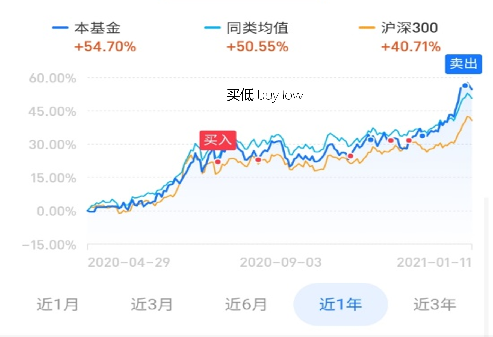
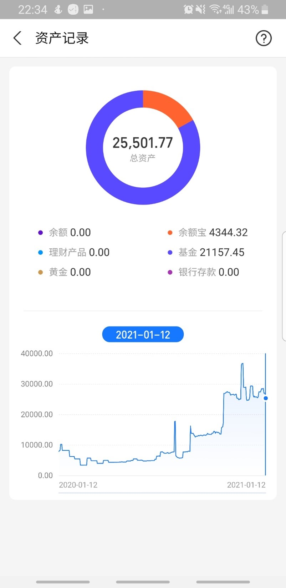
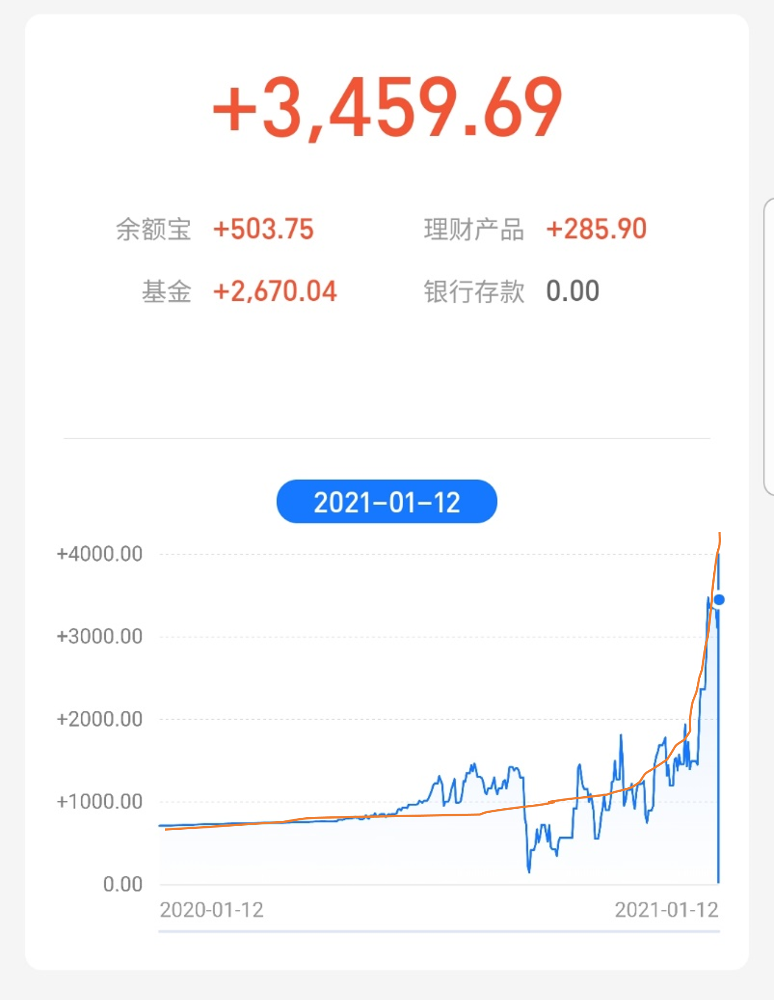
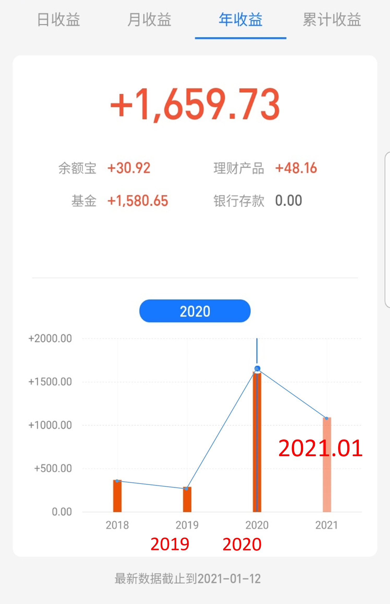
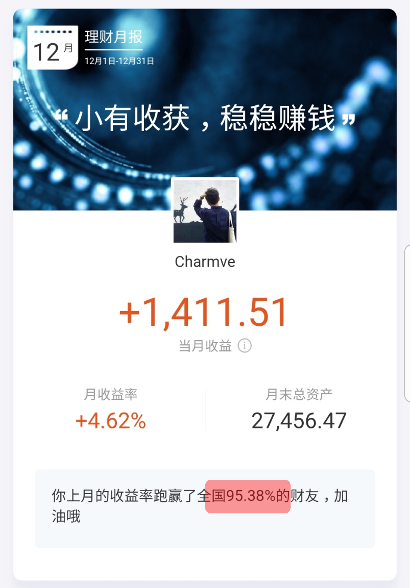
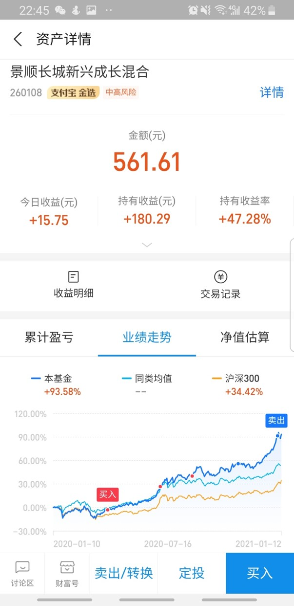
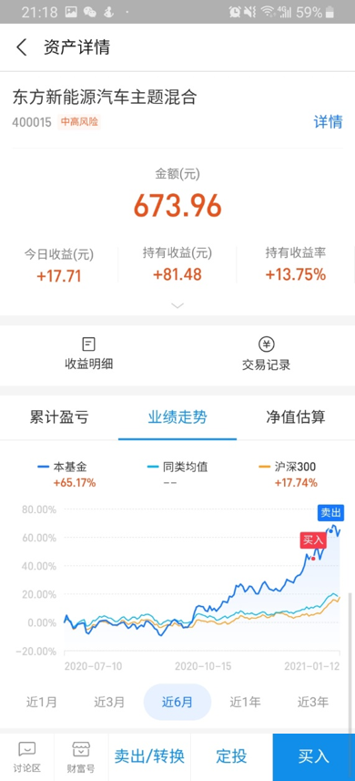
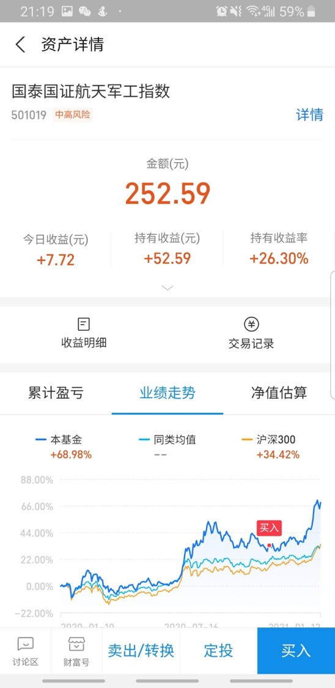
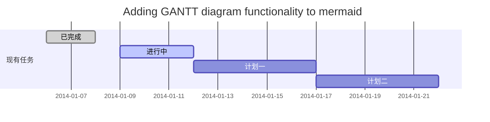

<p align="right">
<a href="https://ufund-me.github.io" target="_blank">Home Page</a> | English | <a href="https://UFund-Me.github.io/404.html" target="_blank">中文</a>
</p>


# UFund, Me

支付宝智能基金理财助理帮你健康理财决策，提高理财收益
<br><br>


<div align="center">
    
</div>

<h3 align="center">UFund, an Alipay Fund Assistant</h3>
<p align="center">
  Alipay Smart Fund Assistant helps you make healthy financial decisions and increase financial returns!
</p>
<p align="center">
  <a href="https://github.com/sindresorhus/awesome">
    
  </a>
  <a href="https://github.com/UFund-Me/UFund">
	
  </a>
  <a href="https://github.com/UFund-Me/UFund">
    
  </a>
</p>

## Why UFund ?

跨平台，实时，基金份额真实模拟，涨跌提醒，加减仓AI辅助决策

## ✨ Features

- 首先点击编辑按钮，在“添加新基金”输入框中输入基金代码（支持按拼音、汉字、编码模糊搜索，支持批量添加）添加需要关注的基金，基金列表支持拖拽排序，顶部的大盘指数信息也支持自定义。

- 可以点击基金名称或指数名称，进入详情页面，查看走势图与持仓明细等基金详情；在基金持仓明细页，可以点击对应股票名称，查看对应股票的详情走势图。

- 更多功能可以通过设置按钮进入设置页面，可以开启角标提醒功能，调整展示内容；可以开启显示估值收益，显示持有收益，开启后可以在编辑按钮中填入持有份额与成本价，插件会自动计算对应的收益情况。

## 🛡 Status: Beta

This project is still under heavy development. Feel free to join us and make your first <a href="https://github.com/UFund-Me/UFund-Me.github.io/pulls" target="_blank">pull request</a> or any <a href="https://github.com/UFund-Me/UFund/issues" target="_blank">issues</a>.

## 🔨 Usage

```jsx
import { Button, DatePicker } from 'antd';

const App = () => (
  <>
    <Button type="primary">PRESS ME</Button>
    <DatePicker placeholder="select date" />
  </>
);
```
And import style manually:
```jsx
import 'antd/dist/antd.css'; // or 'antd/dist/antd.less'
```
### TypeScript
``antd`` is written in TypeScript with complete definitions, check Use in TypeScript to getting started.

## 📦 Contents

- [Summary](#why-ufund-)
- [Install](#-usage)
- [Community](#-community)
- [Code of conduct](#-code-of-conduct)
- [Team](#-sponsors-and-backers)

<div align="center">
    
</div>
<br>

🍅  🍮  ⏱️  🍰   📦   🥕   💼   📚

<div align="center">
    
    <br> <i>A demo of UFund</i>
</div>
<br>

## 📅 Result
> <b>BLSH</b> - Buy low sell high, hold for a long time / “买低卖高，长期持有” is our goal to maintain high-yield investment.

### Average yield <b>28.41%</b>, <b>82.56%</b> increase compared to 2019
### I have been using UFund about half a year, just with ￥26,500.00 principal.

<table>
  <tbody>
    <tr>
      <td style="text-align: left" rowspan="2">
	  <b>UFund increase returns just with little principal</b>
      </td>
      <td style="text-align: center" colspan="3">
	  
      </td>
      <td style="text-align: center" colspan="1">
	  
      </td>
    </tr>
    <tr>
      <td style="text-align: center" colspan="3">
	      investment (this year 2020)
      </td>
      <td style="text-align: center" colspan="1">
	     my principal
      </td>
    </tr>
    <tr>
      <td style="text-align: left" rowspan="2">
	  <b>TEST Total Investment</b>
      </td>
      <td style="text-align: center" colspan="2">
	  
      </td>
      <td style="text-align: left" colspan="1">
	      
      </td>
      <td style="text-align: left" colspan="1">
	      
      </td>
    </tr>
    <tr>
      <td style="text-align: center" colspan="2">
	  Total Investment since Jul 2020
      </td>
      <td style="text-align: center" colspan="1">
	  yield growth curve (have been used UFund since Jul 2020)
      </td>
      <td style="text-align: center" colspan="1">
	  Investment Rank in All Users  
      </td>
    </tr>
    <tr>
      <td style="text-align: left" rowspan="2">
	  <b>CASE</b>    
      </td>
      <td style="text-align: left">
	      
      </td>
      <td style="text-align: left">
	  
      </td>
      <td style="text-align: left">
	  
      </td>
      <td style="text-align: left">
	  
      </td>
    </tr>
    <tr>
      <td style="text-align: center" colspan="4">
	      Average yield <b>28.41%</b>, <b>82.56%</b> increase compared to 2019
      </td>
    </tr>
  </tbody>
</table>

<p align="right">
* Since Jan.12 2021
</p>

## 🍮 Community

Feel free to put up issues at our <a href="https://github.com/UFund-Me/UFund/issues/1#issue-751252906" target="_blank"> COMMUNITY </a>.

## 📚 Code of conduct

[CODE_OF_CONDUCT](./docs/CODE_OF_CONDUCT.md) | <a href="https://UFund-Me.github.io/doc/privacy.html" target="_blank">隐私协议</a>
<br>

## ☕ Processing



- 关于 **UFund** 详细更新进度，请查阅 [这儿](./docs/Changelog.md).

## 🔔 Update Reminder

[Subscribe -->](https://github.com/UFund-Me/UFund/edit/main/README.md)

Business ✉️ email: yidazhang1@gmail.com

## 💖 Sponsors and Backers

[](https://ufund-me.github.io/img/WeChat-sponsor.png)

[](https://ufund-me.github.io/img/WeChat-sponsor.png)

<table>
<tr>
	<td>
		<details>
  		<summary>WeChat</summary>
			
		</details>
	</td>
	<td>
		<details>
  		<summary>Paypal</summary>
			<a href="https://www.paypal.com/paypalme/charmve">
				
				</a>
				<br>Sponor us with <a href="https://www.paypal.com/paypalme/charmve">Paypal</a>
				<br><br>
		</details>
	</td>
	<td>
		<details>
  		<summary>Ko-fi</summary>
			<br>
			<br>
			<a href="https://ko-fi.com/charmve">
				
			</a>
			<br><br>
			<br>Sponor us with <a href="https://ko-fi.com/charmve">Ko-fi</a>
			<br><br><br><br>
		</details>
	</td>
</tr>
</table>
<br>

## 🔗 Reference

[1] 2020 Qlib. https://github.com/microsoft/qlib

[2] https://github.com/iewoai/Quantitative-Investment_Learning

[3] https://github.com/xhlgogo/Quantitative-Investment-Trading-system

[4] https://github.com/avinashbarnwal/Momentum-Strategy

[5] Clairvoyant. https://github.com/anfederico/clairvoyant

[6] [Quantitative Momentum](https://www.amazon.com/Quantitative-Momentum-Practitioners-Momentum-Based-Selection/dp/111923719X/ref=sr_1_1?ie=UTF8&qid=1478201274&sr=8-1&keywords=quantitative+momentum): A Practitioner's Guide to Building a Momentum-Based Stock Selection System (Wiley Finance) Hardcover – Illustrated, October 3, 2016

<!--

### 🍅 Summary
### 📦 Install
### 🍮 Community
### 📚 Code of conduct
### 💼 Team
🦃 🍂 🔥 🍽 🥧 👪 🍗 ☕ 🍾  🥂 
--->
